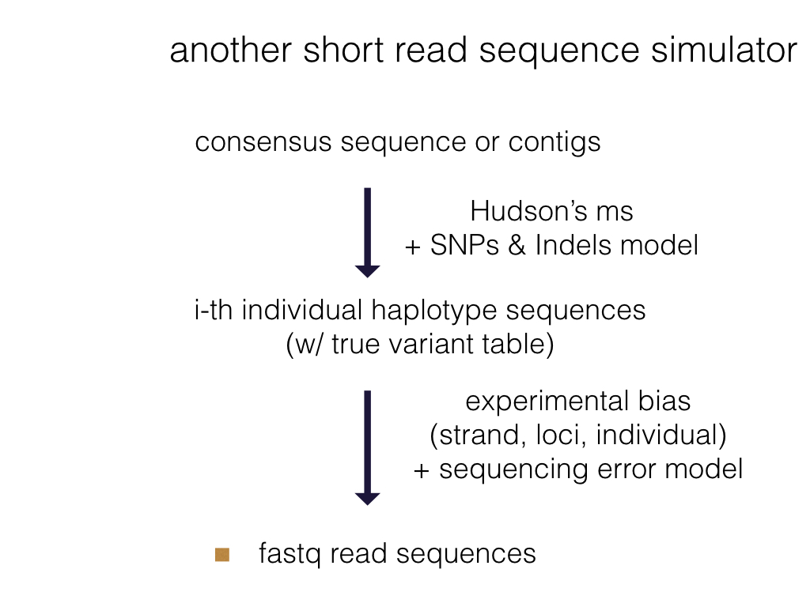
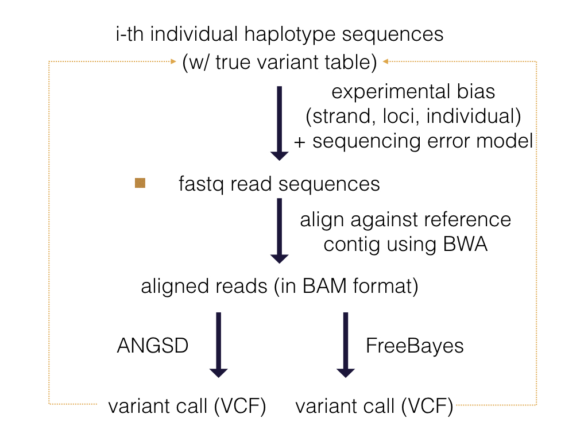

## BattleOfGenotype

### Goal

This project is to assess single-site versus multi-allelic variant detection models for site-directed next-gen read sequences.
Another word, can we accurately infer genotype variants from next-generation read sequences?

Currently, this is being tested against SAMtools, ANGSD, GATK and FreeBayes. I need to check out OCTOPUS.

 

 

### Not another short read simulator

Python `main/PopMs.py`: used to simulate single-end, medium-size (>300 bp) site-specific illumina pooled sample reads (Fastq file), assuming all sampled diploid individuals drawn from the same population 

Disclaimer! My read simulator: 

1) is only suitable for representing reads from site-directed read library where all reads of a single loci begin on the same site
2) does not consider somatic mutation or the event of DNA structural rearrangement
3) assumes that individuals are diploid organism
4) assumes uniform variant rate across all loci
